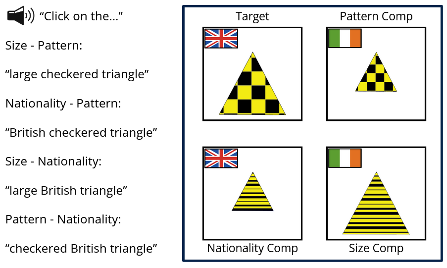
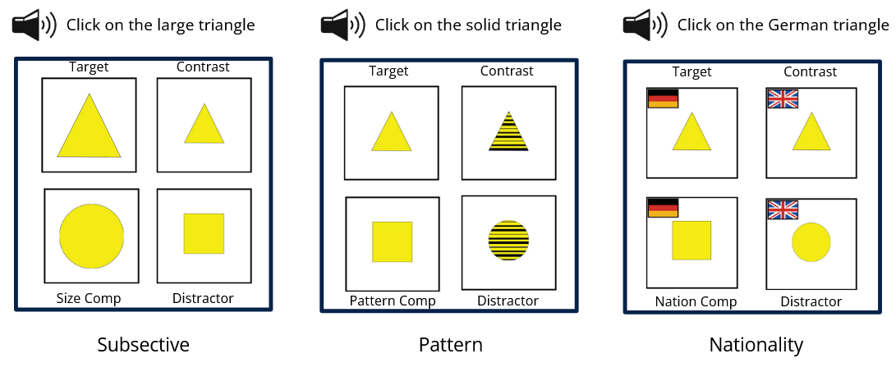
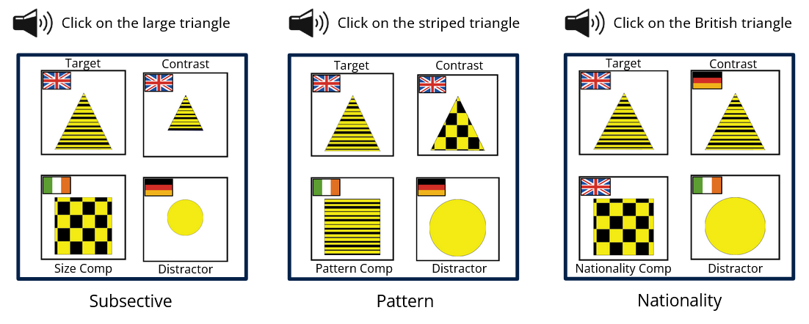
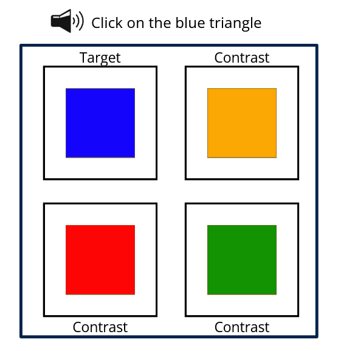
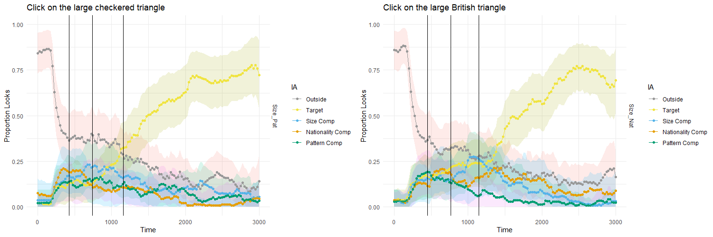
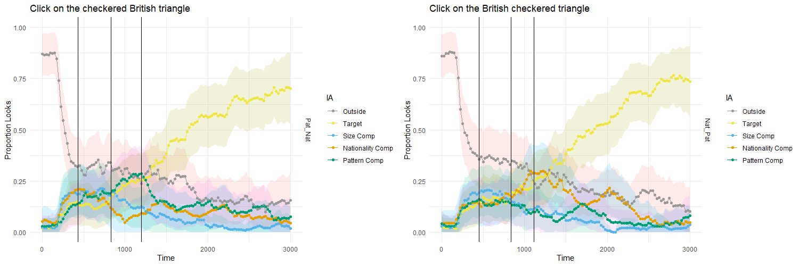
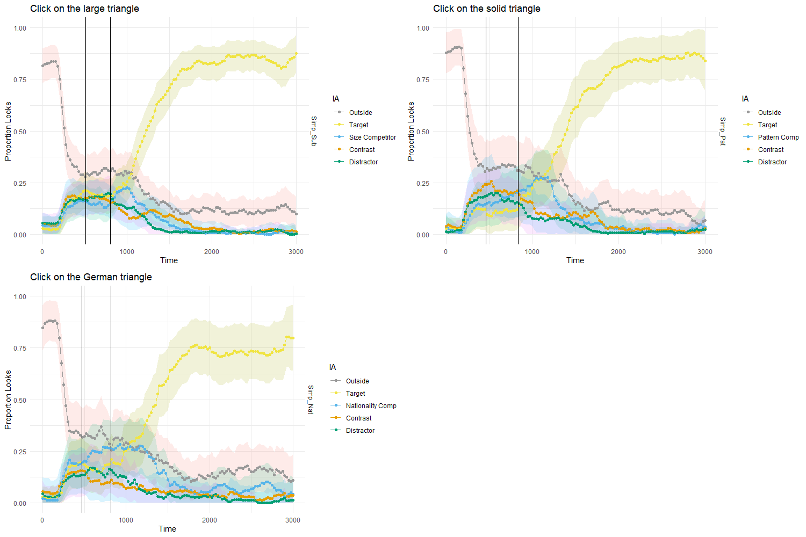
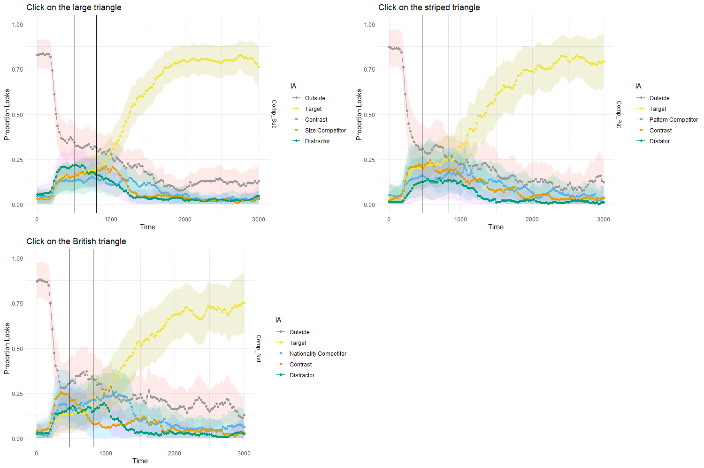

```{r setup, include=FALSE}
knitr::opts_chunk$set(echo = TRUE)
```

**Introduction**

|  Linguistic theories of adjectival meanings posit that interpretation of certain classes of adjectives is highly dependent on a comparison class, which for prenominal adjectives (e.g. big house) is usually provided by the head noun (Kennedy & McNally 2005; Syrett et al. 2009; Aparicio et al. 2015, a.o.). This is the case for subsective relative adjectives like big, which contrast with intersective adjectives like blue, in that they do not show the same dependency on the head noun (Partee 1995). Subsective adjectives depend on the head noun for a property scale, thus a big dog is a vastly different size from a big planet, while intersective adjective do need a scale, meaning that a blue cup and a blue house can be blue in the same manner. Kamp and Partee (1995: 161) capture this dependency through their Head Primacy Principle which links the interpretation of modifiers with the interpretation of the head noun.<br>
| 
|  Despite these dependencies between prenominal adjectives and their head nouns, psycholinguistic literature has been able to detect incremental effects in their online interpretations, suggesting that the interpretation of prenominal adjectives is not delayed until the head noun is encountered. For instance, in a seminal study, Sedivy et al. showed in a set of visual world paradigm eye tracking experiments that multiple kinds of prenominal adjectives are interpreted as they are encountered. By tracking participants' eye movements, Sedivy et al. were able to support that in situations where the linguistic string is temporarily ambiguous between two potential referents adjectives can be used to distinguish between those two referents before the head noun is said (Sedivy et al. 1999).
| 
| While these properties of adjectives and their online interpretation are well established, the interaction between the two is not. Specifically there has not been a systematic study of whether the semantic type of adjective, intersective or subsective, has an effect on the online interpretation of the adjective. In a previous pilot experiment that I conducted I found a trend that indicated that in multiple adjective contexts when a subsective adjective preceded an intersective adjective participants would go back and check between the things that matched the intersective property for which one matched the subsective property even though they had already found that in the subsective adjective window. In contexts where there were two intersective adjectives this same trend was not seen which indicated that this pattern of double checking after the comparison class was update was an observable effect of subsective adjectives' dependence on thier head noun. The experiment presented here attempts to further address the aforementioned gap in the literature by reproducing the double checking trend seen in the previous experiment with an additional subsective-intersective adjective pair that was not used in the previous experiment to see if this is a feature of the specific pair used or if it can be attributed more broadly. Additionally this experiment replicates the Sedivy et al. (1999) study in two different ways to see if the same double checking effect can be seen in single subsective adjective contexts. The result of this study were generally inconclusive on the main effects that were being sought in the two adjective contexts, though the Sedivy et al. results replicated well and a background assumption about the interaction of adjective positioning with the sought phenomenon was supported. 
| 
| 

**Design and Materials**

|   For each trial of this study participants heard an auditory stimulus in the format "click on the X (Y) triangle/circle/square", where X Y represents the possible adjective combinations with the () around the Y representing the fact that some auditory stimuli only contained one adjective. The stimulus was only said once per trial. An associated visual display would be presented to the participant with each of the four images locations randomized so that each image had an equal chance of occurring in each of the four spots. The trials themselves were also randomized so that the 10 conditions were dispersed within the 108 total trials. While images were reused throughout the trials, it was factored into the design that each image would be the target an equal amount of times to control for participants developing expectations about how a particular image might be described.
| 
| 

```{r echo=FALSE,out.width="1000px", fig.cap="Figure 1: Example display for the two adjective conditions. The target shape agreed with each other shape in one of the three possible adjective properties making each other shape a competitor in that demension. Participants clicked on the image that matched the auditory stimulus that they heard. Example stimuli for each of the 4 two adjective conditions are shown to the left."}
library(knitr)

```

| As stated there were a total of 10 conditions in this experiment. 2 two adjective conditions with a subsective adjective (large or little) followed by an intersective adjective with either a pattern (Checkered, Solid, or Striped) or nationality (British, German, or Irish) meaning (9 trials per condition per participant). This was the primary experimental condition as this was where the replication of the double checking when the participant heard the two different kinds of intersective adjectives following the subsective adjective should occur. 2 two adjective conditions with an intersective adjective with either a pattern (Checkered, Solid, or Striped) or nationality (British, German, or Irish) meaning followed by an intersective adjective from the other meaning category (9 trials per condition per participant). These conditions acted as both controls for the position of the adjective by allowing all of the intersective adjectives to occur in every adjective slot and also were a way to test if intersective adjectives could trigger the same pattern of double checking in two adjective situations. An example display and example stimuli for these two adjective conditions are shown in **figure 1**. In total the two adjective conditions accounted for 36 of the experimental trials per participant.
| 
| 

```{r echo=FALSE, out.width="1000px", fig.cap="Figure 2: Example display for the simplified display one adjective conditions. The target agreed with one shape in all but the adjective property of the condition to create a contrast and with a seperate shape in all but the actual shape to create a competitor. The fourth shape did not agree with the target in any property that was relevant in the experiment making it a distractor. Participants clicked on the image that matched the auditory stimulus that they heard. Example stimuli for each of the 3 simplified display one adjective conditions are shown above each condition's display."}
library(knitr)

```

There were also 6 conditions that were part of the Sedivy et al. (1999) replication. All 6 of these conditions only had one adjective in their auditory stimuli. These 6 replication conditions were also divided into 2 sets of three for each of the adjective types (size, nationality, or pattern) so each of these sets of conditions had the same set of auditory stimuli but the visual displays were different.In the simplified set of one adjective conditions shown in **figure 2** the displays were stripped of as many factors as possible. These conditions were to ensure that any trends seen were not the result of the displays being to busy. The complex set of one adjective conditions shown in **figure 3** used the same images as the two adjective conditions and were the main conditions that were being looked at to replicate the finding of Sedivy et al. (1999) as this would indicate that the displays used here were consistent with those used in that experiment in eliciting the incrementality effects that were seen. Each of the subsective conditions had 18 experimental trials while each of the intersective conditions had 9. These trials made up the remaining 72 experimental trials bringing the total to 108 experimental trials per participant.   

```{r echo=FALSE, out.width="1000px", fig.cap="Figure 3: Example display for the complex display one adjective conditions. The target agreed with one shape in all but the adjective property of the condition to create a contrast and with a seperate shape in all but the actual shape to create a competitor. The fourth shape did not agree with the target in any property that was relevant in the experiment making it a distractor. Participants clicked on the image that matched the auditory stimulus that they heard. Example stimuli for each of the 3 complex display one adjective conditions are shown above each condition's display."}
library(knitr)

```

No fillers were used in this experiment because the number and diversity of conditions made it unlikely that any participant would be able to guess the conditions.

**Procedure**

|   Data collection took place in person in the eyetracking room of the Linguistics Meaning Lab at Cornell University. Participants were first trained on the relevant flags through informational screens that showed the flag and told them the nationality. They then moved on to practice trials, example display shown in **figure 4**, where each participant saw three trials in which they were able to disambiguate the target from the contrasts the using only color, an adjective type that was not present in the experimental trials. In the experimental trials, participants were told to click on the item in the computer display that matched the auditory stimuli that they heard.The participants only saw the visual stimuli once the audio was ready to play and the trial was ready to begin. Before each trial screen was displayed, a dot would appear in the center of the screen, which the participant would be asked to look at and a fixation would be taken.
|
|
```{r echo=FALSE, out.width="800px", fig.cap="Figure 4: Example display for the practice trials. Identical shapes were used with each of them being a different color due to the fact that color was not one of the adjectival properties that was relevant to the experimental trials. Participants clicked on the image that matched the auditory stimulus that they heard. Example stimuli for each of the 4 two adjective conditions are shown to the left."}
library(knitr)

```
|   While the participant was listening to the auditory stimuli and completing the clicking task, eye movement data was recorded using a tower mounted EyeLink 1000 + eye tracking system. The camera provided an image of the eye at 2000 Hz and tracked the eye position by the location of the pupil and corneal reflection. Calibration was done before both the practice and experimental blocks of the experiment. Eye tracking began at the start of the auditory stimulus and continued until the participant clicked the image they thought matched the auditory stimulus. 
|
|
**Participants**

|   A total of 17 participants were recruited for the study: 2 were excluded due to issues calibrating leaving a sample of 15 participants (mean age, ~23y; age range, 18 to 39 y; 8 female, 7 male). Participants were students and faculty at Cornell University. Institutional Review Board approval was obtained from Cornell University. All participants provided informed consent and were given debriefing after conclusion of the experimental activities. All participants were recruited through flyer posted around campus and word of mouth advertisement and were compensated for participation with either extra credit in linguistics courses or $15.
|
|
**Predictions**

|   The predictions of this experiment are as follows. In the two adjective conditions where a subsective adjective is followed by an intersective adjective looks to the competitor in that intersective property are expected to increase in the intersective adjective window which would be due to participants updating thier comparison class and then having to reevaluate the subsective (size) adjective which is dependent on that comparison class. In the two adjective conditions where an intersective adjective is followed by an intersective adjective it is expected looks to the first adjective competitor will decrease and most looks will be to the target in the second adjective window and beyond due to participants not having to reevaluate their analysis of any of the adjectives. For the 6 Sedivy et al. (1999) replication conditions it is expected that they will all replicate the similar experiments of that study and a bump in looks to the contrast may be seen in the noun window of the subsective (size) conditions due to participants updating the comparison class with the noun and having to reevaluate the comparison class dependent subsective adjective due to that.
|
|
**Results**

|   This experiment in its goal of working towards understanding how the semantics of adjectives interact with their online interpretation used many different conditions to test and control for many factors. The sample size here of 15 participants is quite low especially for as many conditions as there were and any trends shown are just that trends. No participants were discarded as checking for data loss found all participants to be in the acceptable range. Data preprocessing and graphing was done using the VWPre R package made specifically for working with eyetracking data.
|
|   **Figure 5** shows the results of the primary experimental conditions: the two adjective subsective followed by intersective conditions. In both graphs the first adjective is as expected with roughly equal looks to all the images as participants get their barrings. In the second adjective window as expected more of the looks go to the target and size competitor. In this window it also becomes clear that the competitor in the mentioned intersective property will stay higher throughout the rest of the time. Looking into the noun window there is a bit of a difference between these conditions. In the subsective nationality condition the looks to the nationality competitor dip in the second adjective window but then come back pretty strongly deeper into the noun window. Meanwhile the subsective pattern condition does show a somewhat similar bounce back though not nearly as strong. It should be noted that the nationality competitor in the subsective nationality condition always had more looks to it than the pattern competitor did in the subsective pattern condition at comparable times and therefore the bounce back could simply be proportional. Overall these results are not very conclusive though the trends do somewhat match expectations.  
|
|
```{r echo=FALSE, out.width="1000px", fig.cap="Figure 5: Results for Subsective Pattern (left) and Subsective Nationality (right) Conditions. Each chart is titled with an example stimulus for the condition. The vertical lines demarcate the critical windows for the adjectives with the area between the first and second line representing the first adjective and the area between the second and third line representing the second adjective."}



```
|   Moving now to the two adjective intersective intersective conditions which can be seen in **figure 6** there is not much of note. The expected competitors and target have most of the looks throughout the two adjective windows until it becomes unambiguous starting around the end of the second adjective window. One interesting observation about these graphs is that even though both adjectives are intersective it seems like whichever one was mentioned first in the stimulus maintains a higher proportion of looks throughout the remainder of the trial. In the nationality pattern condition there are also some strange jumps in the noun window that ther is not a corresponding trend of in the noun window of the pattern nationality condition. However there is not significane to any of these observations so again noting is conclusive. Additioanlly these graphs do look different from thier corresponding graphs in the other two adjective conditions which indicates that it is liely not an effect of position within the stimulus that creates the trends seen above. 
|
|
```{r echo=FALSE, out.width="1000px", fig.cap="Figure 6: Results for Pattern Nationality (left) and Nationality Pattern (right) Conditions. Each chart is titled with an example stimulus for the condition. The vertical lines demarcate the critical windows for the adjectives with the area between the first and second line representing the first adjective and the area between the second and third line representing the second adjective."}



```
|   The new conditions out of the way we come to the Sedivy et al. replications. Starting with the results from the simplified displays, which can be seen in **figure 7**, what seems to be remarkable is the sameness across conditions. In all cases the condition appropriate competitor and target maintain high proportions of looks until the point of disambiguation. After the target has been found all other images' looks approach near zero except for the nationality competitor in the Nationality condition which maintains a low proportion of looks throughout. There are also some minor spikes to the contrasts in the Size and Pattern conditions but this is likely noise as there is no clear linking factor between these trends.   
|
|
```{r echo=FALSE, out.width="1000px", fig.cap="Figure 7: Results for Sedivy et al. Replication with Simplified Displays. Size (top left), Pattern (top right) and Nationality (bottom left) conditions are all represented. Each chart is titled with an example stimulus for the condition. The vertical lines demarcate the critical windows with the area between the lines representing the adjective window."}



```
|   Results from the complex display Sedivy et al. replications, shown in **figure 8**, have many of the same trends as the simplified displays. Again the the condition appropriate competitor and target maintain high proportions of looks until the point of disambiguation and subsequently approach zero though not quite as drastically as in the simplified displays indicating that the complexity of the display introduces uncertainty which is an entirely logical idea. The nationality competitor in the Nationality condition is also seen to have a higher proportion of looks in the noun window relative to the other images both within and outside of that condition.
|
|
```{r echo=FALSE, out.width="1000px", fig.cap="Figure 8: Results for Sedivy et al. Replication with Complex Displays. Size (top left), Pattern (top right) and Nationality (bottom left) conditions are all represented. Each chart is titled with an example stimulus for the condition. The vertical lines demarcate the critical windows with the area between the lines representing the adjective window."}



```
|   
|
|
**Discussion**

|   The results presented above return a strong inconclusive. They seem to be neither a direct replication of that previous pilot nor a direct rebuttal. The two adjective Subsective Intersective conditions do seem to have similar bumps to the previous exeriment but not to the same magnitude or in the same place. The two adjective Intersective Intersective conditions do seem to have succeeded in showing that whatever is happening in the Subsective Intersective conditions is not simply a result of adjective position. And the Sedivy et al. replications seem to have successfully replicated but did not show any other interesting trends. This study was limited by the amount of participants that could be recruited in the alloted time which was likely not helpful to the clarity of the trends and there was a limited number of experimental trials for the two adjective conditions overall but it should be noted that the previous experiment which did show the trend more clearly had a similar number of participants (18) and 1 fewer trial per experimental condition. Overall these results seem to call for further testing if not experimental redesign to add more experimental trials for the two adjective conditions. 
|
|
**Conclusions**

|   This study has found support for the incrementality effects that Sedivy et al. (1999) found, has seen indications that it is not adjective positioning that result in strangeness in subsective intersective conditions, and has shown that the trends that this study was seeking are not as stable as was thought. Though the results were not conclusive nor particularly interpretable the work done here is still valuable. It prompts better designs for collecting this kind of data and reminds that humans and all thier behaviors are messy. Furthermore this work is important because if we can pin down the mess this work would allow us to have a measurable marker of semantic dependency which would be both an incredible proof of concept for several aspects of theoretical semantics and also a great achievement for psycholinguistics and eye-tracking. 
|
|   
**References**

Aparicio, Helena, Ming Xiang, & Christopher Kennedy. 2015. Processing gradable adjectives in context: A Visual World study. Semantics and Linguistic Theory (SALT) 25, 413-431. Ithaca, NY: CLC.

Kamp, Hans, & Barbara Partee. 1995. Prototype theory and compositionality. Cognition 57 129-191.

Kennedy, Christopher & Louise McNally. 2005. Scale structure and the semantic typology of gradable predicates. Language 81(2). 345-381.

Partee, Barbara. 1995. Lexical semantics and compositionality. An Invitation to Cognitive Science (Second Edition). Volume 1: Language, eds. Lila Gleitman and Mark Liberman, 311-360. Cambridge: MIT Press.

Sedivy, Julie C., Michael K. Tanenhaus, Craig G. Chambers, & Gregory N. Carlson. 1999. Achieving Incremental Semantic Interpretation through Contextual Representation. Cognition 71(2). 109-147.

Syrett, Kristen, Christopher Kennedy, & Jeffrey Lidz. 2009. Meaning and context in children's understanding of gradable adjectives. Journal of Semantics 27(1). 1-35.
